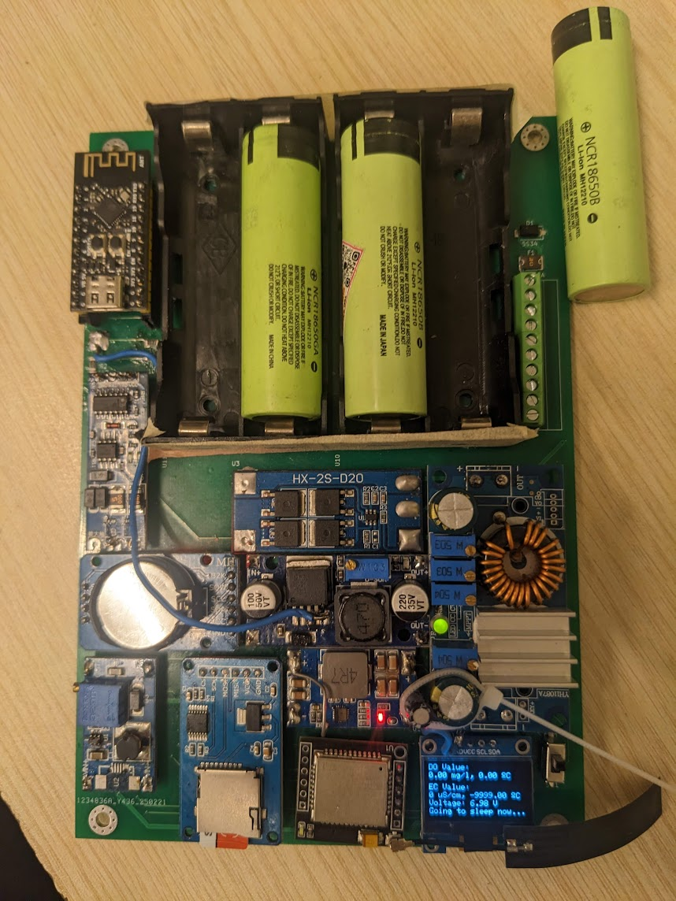
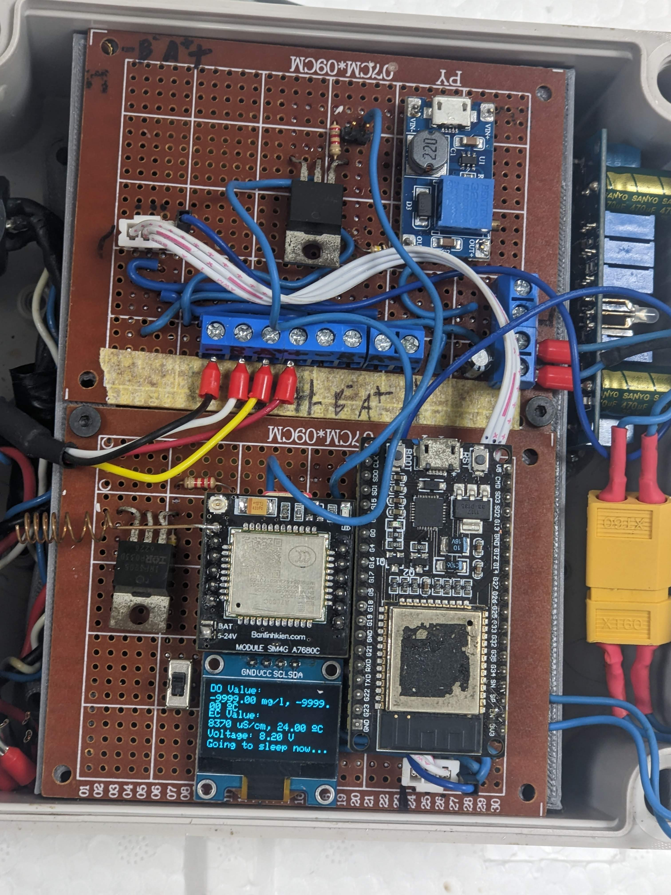
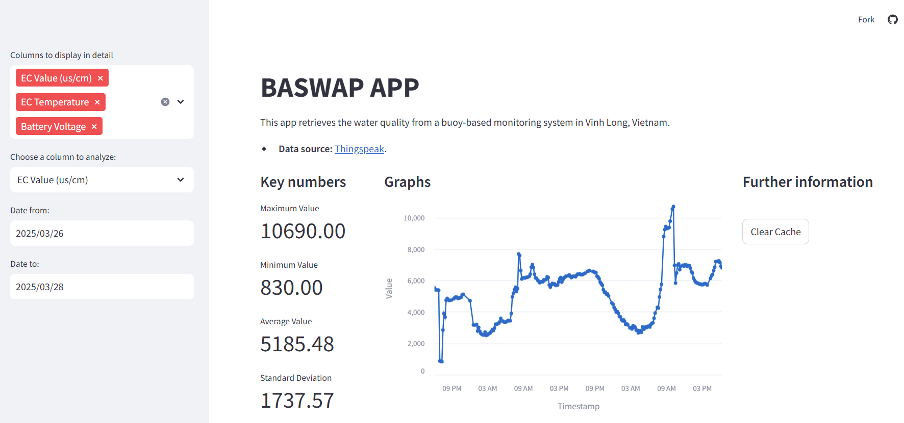
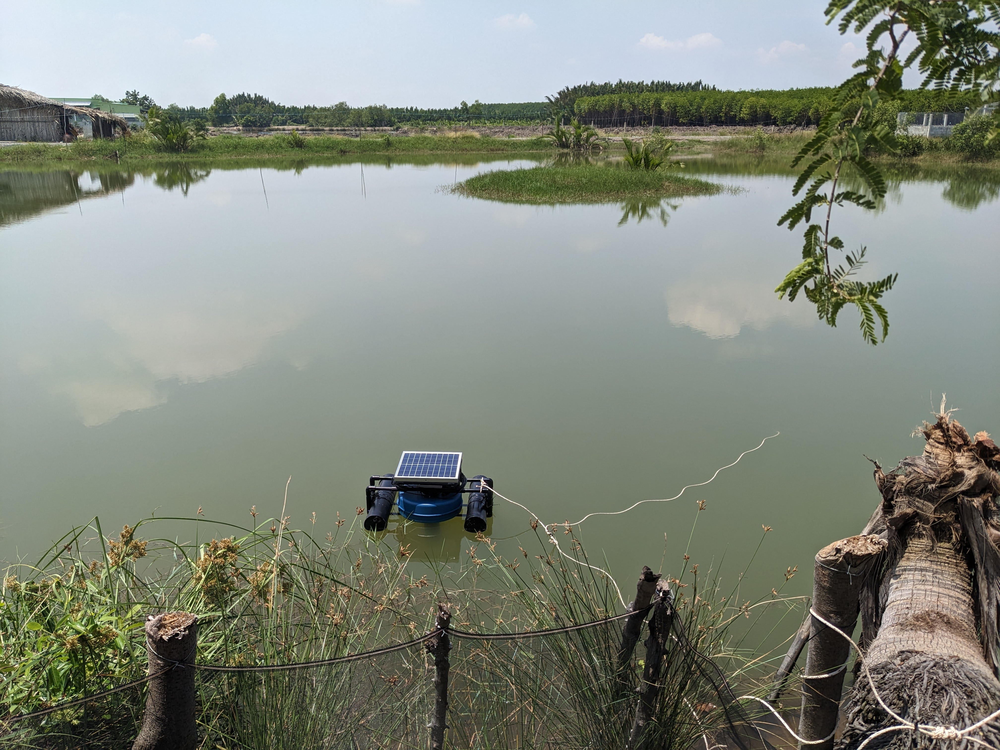

# 🌊 Solar-Powered IoT Salinity Monitoring System

## 📖 Project Overview

This project focuses on developing a **real-time salinity monitoring system** for remote water bodies. It is designed to operate **24/7**, powered by a **solar panel and battery system**, and uses the **Simcom A7680 LTE module** to upload data to **ThingSpeak** or a cloud database. The system enables **unattended, continuous monitoring** in environments where wired infrastructure is unavailable.

## 🌟 Key Features

- **Real-time salinity data monitoring** using custom-built IoT hardware  
- **LTE data transmission** via Simcom A7680 module  
- **Solar-powered with battery backup** for off-grid deployment  
- **Low-power design** for long-term operation in remote locations  
- **Data integration** with platforms like ThingSpeak or cloud databases  

## 🛠️ What I Worked On

- 🧩 **Designed custom PCBs** in KiCad to support outdoor deployment and energy efficiency  
- 🧠 **Developed embedded firmware** on ESP32 (C/C++) for sensor interfacing and LTE communication  
- 🔧 **Created custom libraries** to read data from salinity sensors  
- 🔋 **Calculated energy needs** and selected appropriate solar panel and battery sizes for reliable 24/7 performance  
- 💤 **Optimized power consumption** through sleep modes and efficient code  
- 🧪 **Assisted deployment and testing** with the research team in real-world environments  

## 📦 System Components

- **ESP32-C3** microcontroller  
- **Simcom A7680** LTE module  
- **Salinity sensor** (custom interfacing)  
- **15W Solar Panel** with 18650 battery storage  
- Custom-designed **PCB** for field deployment  

## 🌐 Data Upload

Sensor data is transmitted hourly via LTE to:
- **ThingSpeak** (for visualization and alerts), or  
- A **custom cloud database** for storage and further analysis

## 📂 Project Structure

```
/.vscode         → VSCode configuration files  
/code            → Embedded firmware and source code  
/imgs            → Images or diagrams for documentation  
README.md        → Project summary and overview (this file)  
schematic.pdf    → Hardware circuit schematic  
.gitignore       → Git ignore rules  
```

## 🚀 Deployment

This system is currently being tested and deployed in **remote aquatic environments** as part of a research initiative focused on environmental monitoring and smart agriculture.

## 📸 Device Preview
Here is a photo of the deployed salinity monitoring device:
- PCB of device

- Prototype

- Streamlit app 

- Test in real environment

### Important links
- [EC Sensor Library](https://github.com/tuchau1404/ECTDS10_Modbus)
- [EC Documents](https://drive.google.com/drive/folders/1hncmjJqfUVRawqIBNy7eqLtmfCup9ZS6?usp=sharing)
- [Thingspeak Device1](https://thingspeak.mathworks.com/channels/2652379)
- [Thingspeak Device2](https://thingspeak.mathworks.com/channels/2859624)
- [Streamlit GUI App](https://baswap-app.streamlit.app/)
- [Device list](https://docs.google.com/spreadsheets/d/1m3qKdZznI4jfmvPm_3H1yemph4VKm6-8AGkJWUl8WHI/edit?usp=sharing)

